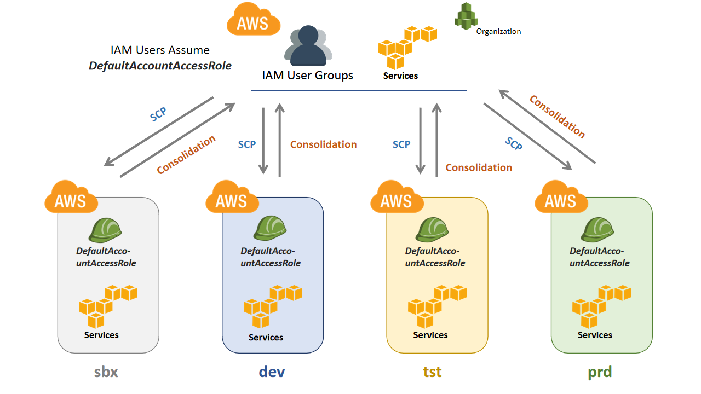

## The problem

What could go wrong with monolithic infrastructure for development ?

- All deployments in one account could lead to tragic situations in maintenance.
- Not every role in an organization need same level of access.
- There should be a clear separation between development and test environments for proper quality assurance.

## Architecture

Codetaut hosted its services in `AWS (Amazon Web Services) <https://aws.amazon.com>`\_ spread across regions.
The organization is based on multi account architecture. Codetaut group spread out its environments into 4 independent accounts
namely as below

- sbx (Sandbox)
- dev (Development)
- tst (Test)
- prd (Production)

- There is only one parent organization with account name `codetautgroup` (might be referred as `codetaut` as well)
- All users and user groups are created in `codetautgroup` IAM service.
- All the above listed accounts namely `sbx`, `dev`, `tst`, `prd` are created under this organizational unit.
- Service control policies (SCPs) are created under `codetautgroup`, to give each account with list of allowed services.
- User groups in organizational unit are assigned to service roles (that are created in individual accounts)
  that a user can assume to get access to the corresponding account.
